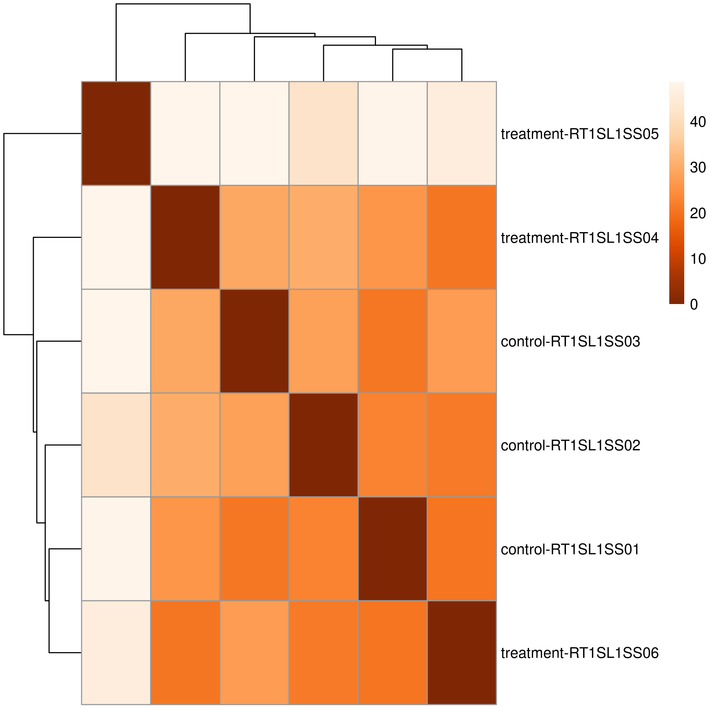
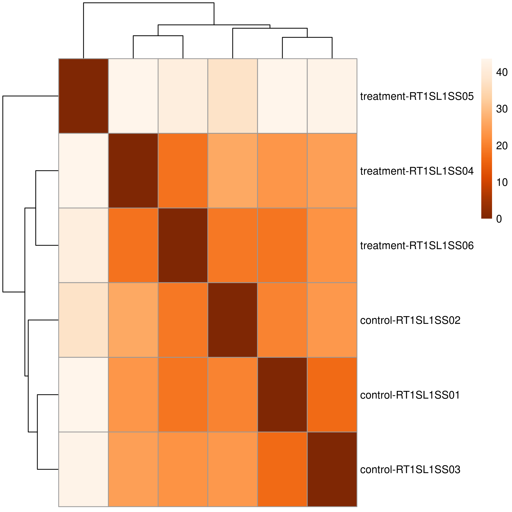
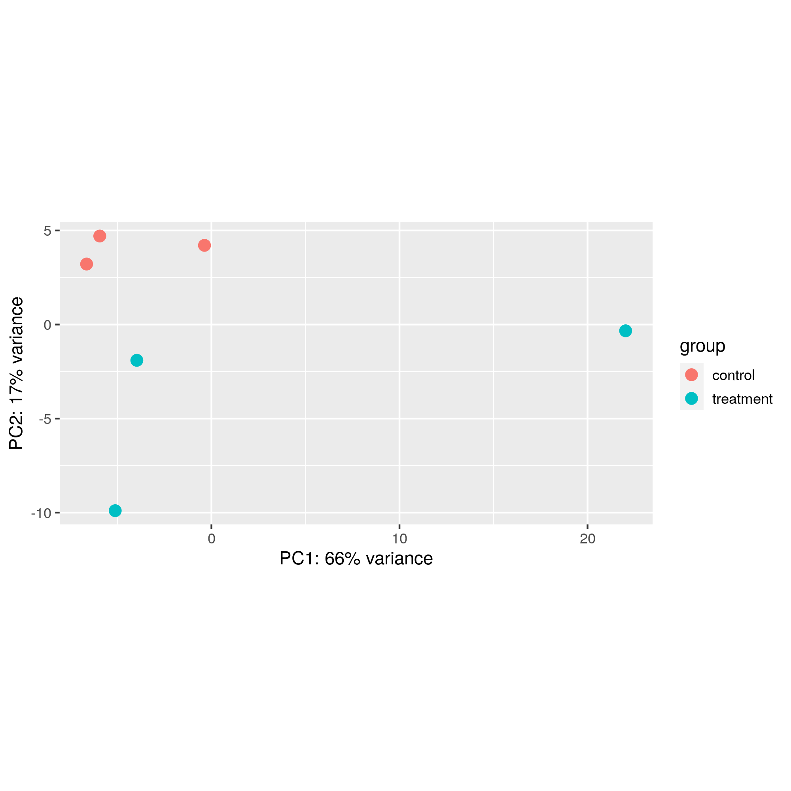
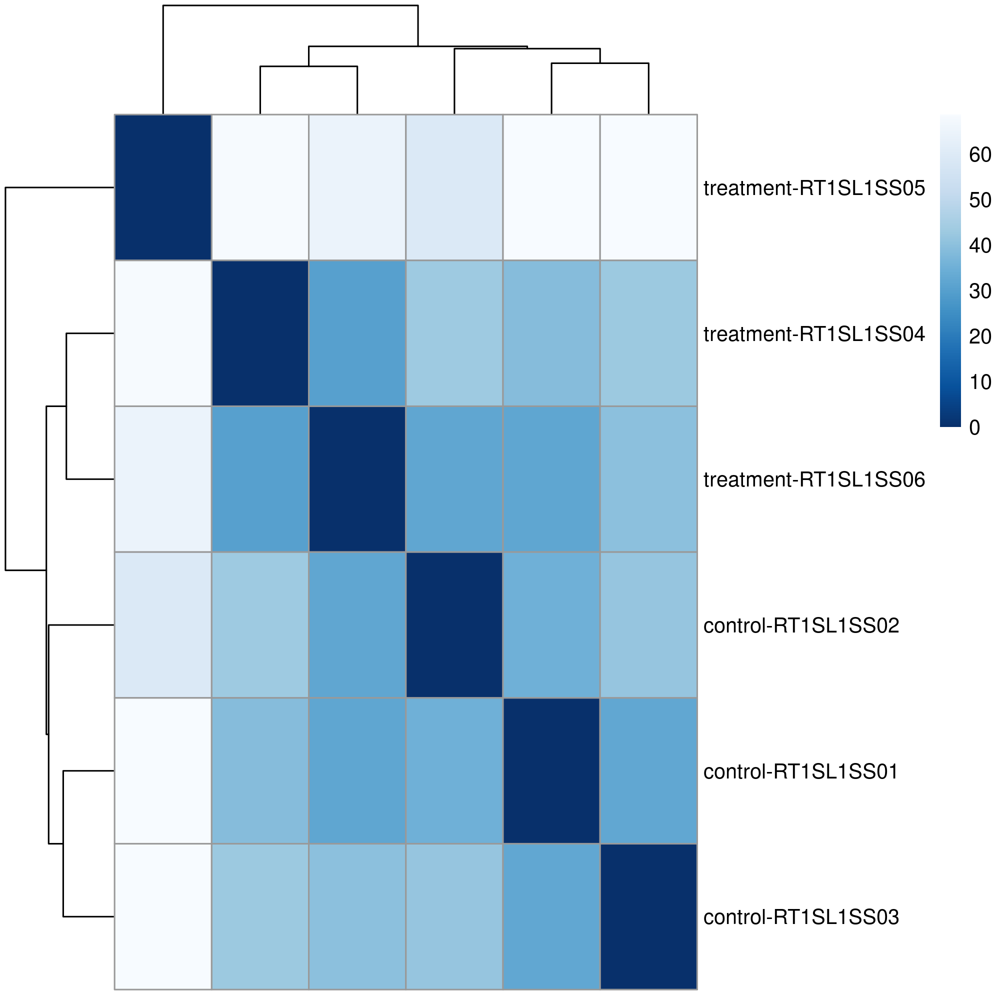

Contenido
=========
* [Datos recibidos](#datos-recibidos)
* [Programas empleados](#programas-empleados)
* [Protocolo](#protocolo)
	* [00_genome](#00_genome)
	* [01_raw](#01_raw)
	* [02_QC](#02_QC)
	* [03_ribosomal_filtering](#03_ribosomal_filtering)
	* [04_STAR](#04_STAR)
	* [05_hisat2](#05_hisat2)
	* [06_kallisto](#06_kallisto)
	* [07_RSEM](#07_RSEM)
	* [08_stringtie](#08_stringtie)
	* [09_deseq2](#09_deseq2)
		* [kallisto](#kallisto)
		* [rsem](#rsem)
		* [stringtie](#stringtie)
	* [10_trinity](#10_trinity)
* [Referencias](#referencias)

# Datos recibidos

En total se recibieron 6 archivos en formato fastq correspondientes a la secuenciación de tres replicas de bibliotecas de RNAseq *single-end* de *Solanum lycopersicum*:

|Archivo                    |Lecturas|
|---------------------------|--------|
|RT1SL1SS01_FILT_R1.fastq.gz|21070546|
|RT1SL1SS02_FILT_R1.fastq.gz|28148664|
|RT1SL1SS03_FILT_R1.fastq.gz|18305072|
|RT1SL1SS04_FILT_R1.fastq.gz|26390905|
|RT1SL1SS05_FILT_R1.fastq.gz|22405794|
|RT1SL1SS06_FILT_R1.fastq.gz|30551636|

Adicionalmente se recibieron los archivos del genoma de *Solanum lycopersicum* (Sly)

|Archivo                          |Descripción                                             |Formato|
|---------------------------------|--------------------------------------------------------|-------|
|chrMT_solanum_lycopersicum.fna   |Genoma mitocondrial de Sly                              |Fasta  |
|chrPltd_solanum_lycopersicum.fna |Genoma del plastido de Sly                              |Fasta  |
|data_report.yaml                 |Información del proyecto de secuenciación de Sly        |YAML   |
|genoma_solanum_lycopersicum.fna  |Secuencia genómica de Sly                               |Fasta  |
|genomic_solanum_lycopersicum.gbff|Anotación funcional de Sly                              |GenBank|
|genomic_solanum_lycopersicum.gff |Anotación funcional de Sly                              |GFF3   |
|protein_solanum_lycopersicum.faa |Secuencias aminoacídicas de los genes de Sly            |Fasta  |
|rna_solanum_lycopersicum.fna     |Secuencias nucleotídicas de los genes de Sly            |Fasta  |
|unplaced.scaf.fna                |Contigs de Sly no ensamblados en el genoma de referencia|Fasta  |

# Programas empleados

A partir de estos archivos se realizó un análisis de expresión diferencial, para lo cual se llevó a cabo un protocolo que consiste en:

0. Preparación del espacio de trabajo e indexado del genoma y sus anotaciones
1. Examinación de la calidad promedio de los datos de secuenciación usando [FastQC](https://www.bioinformatics.babraham.ac.uk/projects/fastqc/) v0.11.9
2. Eliminación de lecturas potencialmente pertenecientes a RNAs ribosomales usando [SortMeRNA](https://bioinfo.lifl.fr/RNA/sortmerna/) v4.2.0 [[ref](https://pubmed.ncbi.nlm.nih.gov/23071270/)]
3. Alineamiento de las lecturas al transcriptoma de referencia usando [STAR](https://github.com/alexdobin/STAR) v2.7.6a [[ref](https://pubmed.ncbi.nlm.nih.gov/23104886/)]
4. Alineamiento de las lecturas al transcriptoma de referencia usando [hisat2](http://daehwankimlab.github.io/hisat2/) v2.2.1 [[ref](https://pubmed.ncbi.nlm.nih.gov/31375807/)]
5. Pseudoalineamiento de las lecturas al transcriptoma de referencia usando [kallisto](https://pachterlab.github.io/kallisto) v0.46.2 [[ref](https://pubmed.ncbi.nlm.nih.gov/27043002/)]
6. Cuantificación de las lecturas alineadas usando [RSEM](https://github.com/deweylab/RSEM) v1.3.3 [[ref](https://pubmed.ncbi.nlm.nih.gov/21816040/)]
7. Cuantificación de las lecturas alineadas usando [stringtie](https://ccb.jhu.edu/software/stringtie/) v2.1.4 [[ref](https://pubmed.ncbi.nlm.nih.gov/25690850/)]
8. Evaluación de la expresión diferencial usando [DESeq2](https://bioconductor.org/packages/release/bioc/html/DESeq2.html) v1.28.1 [[ref](https://pubmed.ncbi.nlm.nih.gov/25516281/)]
9. Ensamble *de novo* de un trascriptoma global usando [Trinity](https://github.com/trinityrnaseq/trinityrnaseq) v2.11.0 [[ref](https://pubmed.ncbi.nlm.nih.gov/21572440/)]

# Protocolo

`00_genome`
-----------
Los archivos recibidos fueron concatenados y ajustados para mantener un prefijo constante a lo largo de todo el procedimiento, todos los archivos generados en este paso fueron albergados en el directorio `00_genome`

```bash
# Creación del espacio de trabajo
work_dir="$HOME/solanum_lycopersicum"
mkdir -p $work_dir
cd $work_dir
mkdir 00_genome  01_raw  02_QC  03_ribosomal_filtering  04_STAR  05_hisat2  06_kallisto  07_RSEM  08_stringtie  09_deseq2  10_trinity
# Concatenación de los archivos necesarios del genoma y preparación de índices
cat genoma_solanum_lycopersicum.fna unplaced.scaf.fna chrMT_solanum_lycopersicum.fna chrPltd_solanum_lycopersicum.fna > 00_genome/Solanum_lycopersicum.fasta
cp genomic_solanum_lycopersicum.gbff 00_genome/Solanum_lycopersicum.gbk
cp genomic_solanum_lycopersicum.gff 00_genome/Solanum_lycopersicum.gff
cp protein_solanum_lycopersicum.faa 00_genome/Solanum_lycopersicum.faa
cp rna_solanum_lycopersicum.fna 00_genome/Solanum_lycopersicum.ffn
gffread -E genomic_solanum_lycopersicum.gff -T -o 00_genome/Solanum_lycopersicum.gtf
gffread -w 00_genome/Solanum_lycopersicum.gtf.ffn -g 00_genome/Solanum_lycopersicum.fasta 00_genome/Solanum_lycopersicum.gtf
STAR --runThreadN 12 --runMode genomeGenerate --genomeDir 00_genome --genomeFastaFiles 00_genome/Solanum_lycopersicum.fasta --sjdbGTFfile 00_genome/Solanum_lycopersicum.gtf
rsem-prepare-reference --gtf 00_genome/Solanum_lycopersicum.gtf 00_genome/Solanum_lycopersicum.fasta 00_genome
kallisto index -i 00_genome/Solanum_lycopersicum.kidx 00_genome/Solanum_lycopersicum.ffn
extract_splice_sites.py 00_genome/Solanum_lycopersicum.gtf > 00_genome/Solanum_lycopersicum.hisat2.ss
extract_exons.py 00_genome/Solanum_lycopersicum.gtf > 00_genome/Solanum_lycopersicum.hisat2.exon
hisat2-build --ss 00_genome/Solanum_lycopersicum.hisat2.ss --exon 00_genome/Solanum_lycopersicum.hisat2.exon 00_genome/Solanum_lycopersicum.fasta 00_genome/Solanum_lycopersicum.hisat2
```

`01_raw`
--------
`02_QC`
-------
Las lecturas de secuenciación fueron depositadas en la carpeta `01_raw` para su posterior acceso, a lo largo del protocolo se crearon links simbólicos en las distintas carpetas de trabajo para reducir el espacio empleado

```bash
# Ubicación de las lecturas en la carpeta 01_raw
mv RT1SL1SS01_FILT_R1.fastq.gz  RT1SL1SS02_FILT_R1.fastq.gz  RT1SL1SS03_FILT_R1.fastq.gz  RT1SL1SS04_FILT_R1.fastq.gz  RT1SL1SS05_FILT_R1.fastq.gz  RT1SL1SS06_FILT_R1.fastq.gz 01_raw

# Examinación de los scores de calidad de las lecturas filtradas
cd 02_QC
ln -s $work_dir/01_raw/*.gz .
fastqc *.gz
rm *.gz
```

Al termino de la corrida de fastQC, se obtuvieron los siguientes reportes en formato html en los que se puede observar que las lecturas a partir de las cuales se realizó el análisis de expresión diferencial son de buena calidad y que no requieren un procesamiento adicional

* [RT1SL1SS01_FILT_R1_fastqc.html](02_QC/RT1SL1SS01_FILT_R1_fastqc.html)
* [RT1SL1SS02_FILT_R1_fastqc.html](02_QC/RT1SL1SS02_FILT_R1_fastqc.html)
* [RT1SL1SS03_FILT_R1_fastqc.html](02_QC/RT1SL1SS03_FILT_R1_fastqc.html)
* [RT1SL1SS04_FILT_R1_fastqc.html](02_QC/RT1SL1SS04_FILT_R1_fastqc.html)
* [RT1SL1SS05_FILT_R1_fastqc.html](02_QC/RT1SL1SS05_FILT_R1_fastqc.html)
* [RT1SL1SS06_FILT_R1_fastqc.html](02_QC/RT1SL1SS06_FILT_R1_fastqc.html)

`03_ribosomal_filtering`
------------------------
Con la finalidad de eliminar lecturas que potencialmente corresponden a rRNAs, se empleó el programa SortMeRNA y la base de datos SILVA usando las secuencias de rRNAs eucarióticos 18S y 16S

```bash
#Preparación de la base de datos sortmerna
mkdir /usr/local/bioinformatics/sortmerna_db/
cd /usr/local/bioinformatics/sortmerna_db/
wget https://github.com/biocore/sortmerna/archive/v4.2.0.zip
unzip v4.2.0.zip
mv sortmerna_db/sortmerna-4.2.0/data/rRNA_databases/* /usr/local/bioinformatics/sortmerna_db/
rm -rf v4.2.0.zip sortmerna_db
cd $work_dir/03_ribosomal_filtering
ln -s $work_dir/01_raw/*.gz .
ref_18S="/usr/local/bioinformatics/sortmerna_db/silva-euk-18s-id95.fasta"
ref_28S="/usr/local/bioinformatics/sortmerna_db/silva-euk-28s-id98.fasta"
for reads_file in RT1SL1SS01_FILT_R1.fastq.gz RT1SL1SS02_FILT_R1.fastq.gz RT1SL1SS03_FILT_R1.fastq.gz RT1SL1SS04_FILT_R1.fastq.gz RT1SL1SS05_FILT_R1.fastq.gz RT1SL1SS06_FILT_R1.fastq.gz
do
	base_name=$(echo $reads_file | cut -d_ -f1)
  sortmerna -ref ${ref_18S} -ref ${ref_28S} -reads $reads_file --aligned ${base_name}.f.aligned.rRNA --other ${base_name}.f.filtered --fastx --task 4 -v --workdir ${base_name}
	gzip -9 ${base_name}.f.aligned.rRNA.fastq ${base_name}.f.filtered.fastq
done
```

Al termino de la ejecución de sortmerna, las lecturas albergadas en los archivos `${base_name}.f.filtered.fastq` contendrá unicamente lecturas libres de RNAs ribosomales.

A continuación se muestra el porcentaje de remoción de lecturas correspondientes a RNAs ribosomales por muestra:

|Muestra   |% Lecturas útiles|% Lecturas rRNA|
|----------|-----------------|---------------|
|RT1SL1SS01|96.9159          |3.08412        |
|RT1SL1SS02|97.7306          |2.26941        |
|RT1SL1SS03|96.7725          |3.2275         |
|RT1SL1SS04|97.758           |2.24198        |
|RT1SL1SS05|96.8013          |3.1987         |
|RT1SL1SS06|96.3873          |3.61271        |

Las lecturas útiles fueron empleadas para la estimación de la abundancia de los transcritos de *Solanum lycopersicum*

`04_STAR`
---------
Las lecturas útiles obtenidas en el paso anterior fueron alineadas al transcriptoma de referencia usando STAR

```bash
cd ${work_dir}/04_STAR
ln -s ${work_dir}/03_ribosomal_filtering/*.filtered.fastq.gz .
for base_name in RT1SL1SS01 RT1SL1SS02 RT1SL1SS03 RT1SL1SS04 RT1SL1SS05 RT1SL1SS06
do
  STAR --genomeDir ${work_dir}/00_genome/Solanum_lycopersicum --readFilesCommand zcat --readFilesIn ${base_name}.f.filtered.fastq.gz --outSAMtype BAM SortedByCoordinate --limitBAMsortRAM 64000000000 --outSAMunmapped Within --twopassMode Basic --outFilterMultimapNmax 1 --quantMode TranscriptomeSAM --runThreadN 12 --outFilterMatchNmin 20 --outFileNamePrefix ${base_name}
done
rm *.filtered.fastq.gz
```

Al termino de la corrida de STAR se obtuvieron alineamientos de lecturas en formato bam, los cuales fueron empleados para determinar las cuentas de los transcritos empleando rsem. Los alineamientos generados produjeron las siguientes estadísticas

|Muestra|% Lecturas con alineamiento único|% Lecturas alineadas correctamente a sitios múltiples|% Lecturas alineadas a demasiados loci|
|----------|------|-----|-----|
|RT1SL1SS01|97.36%|0.00%|1.65%|
|RT1SL1SS02|97.22%|0.00%|1.87%|
|RT1SL1SS03|97.46%|0.00%|1.79%|
|RT1SL1SS04|97.20%|0.00%|1.74%|
|RT1SL1SS05|97.49%|0.00%|1.45%|
|RT1SL1SS06|97.41%|0.00%|1.72%|

`05_hisat2`
-----------
Las lecturas útiles obtenidas en el paso `03_ribosomal_filtering` fueron alineadas al transcriptoma de referencia usando hisat2
```bash
cd ${work_dir}/05_hisat2
ln -s ${work_dir}/03_ribosomal_filtering/*.filtered.fastq.gz .
for base_name in RT1SL1SS01 RT1SL1SS02 RT1SL1SS03 RT1SL1SS04 RT1SL1SS05 RT1SL1SS06
do
  hisat2-align-s --wrapper basic-0 -x ../00_genome/Solanum_lycopersicum.hisat2 -q --very-sensitive --threads 12 -S ${base_name}.sam -U ${base_name}.f.filtered.fastq
	samtools view -h -b -@ 12 -o ${base_name}.tmp.bam ${base_name}.sam
	samtools sort -l 9 -@ 12 -o ${base_name}.bam ${base_name}.tmp.bam
	samtools index ${base_name}.bam
done
rm *.filtered.fastq.gz *.sam *.tmp.bam
```

Al termino de la corrida de hisat2 se obtuvieron alineamientos de lecturas en formato bam, los cuales fueron empleados para determinar las cuentas de los transcritos empleando stringtie.

`06_kallisto`
-------------

La abundancia de los transcritos en cada condición fue estimada empleando Pseudoalineamientos con kallisto

```bash
cd ${work_dir}/06_kallisto
ln -s ${work_dir}/03_ribosomal_filtering/*.filtered.fastq.gz .
for base_name in RT1SL1SS01 RT1SL1SS02 RT1SL1SS03 RT1SL1SS04 RT1SL1SS05 RT1SL1SS06
do
	kallisto quant --single --index ../00_genome/Solanum_lycopersicum.kidx --output-dir $base_name --bias --threads 12 --verbose --fragment-length 200 --sd 30 ${base_name}.f.filtered.fastq.gz
done
rm *.filtered.fastq.gz
```

Al termino de la corrida de kallisto, se obtienen archivos tabulares de cuantificación con los que se puede alimentar deseq2 a través de la biblioteca tximport

`07_RSEM`
---------

A partir de las lecturas alineadas con STAR, calculamos la abundancia de los transcritos empleando rsem

```bash
cd ${work_dir}/07_RSEM
ln -s ${work_dir}/04_STAR/*.toTranscriptome.out.bam .
for base_name in RT1SL1SS01 RT1SL1SS02 RT1SL1SS03 RT1SL1SS04 RT1SL1SS05 RT1SL1SS06
do
  mkdir -p ${base_name}
  rsem-calculate-expression --bam --no-bam-output -p 12 --strandedness none ${base_name} Aligned.toTranscriptome.out.bam ${work_dir}/00_genome/Solanum_lycopersicum ${base_name}
done
rm *.toTranscriptome.out.bam
```

Al termino de la corrida de RSEM obtenemos las abundancias de los transcritos (isoformas) y de los genes en formato tabular con la siguiente estructura

```
transcript_id	gene_id	length	effective_length	expected_count	TPM	FPKM	IsoPct
rna-NM_001329055.1	gene-2-CP1	1127	1017.91	1553.98	92.02	83.17	100.00
rna-NM_001329054.1	gene-2-CP2	1080	970.91	1697.00	105.35	95.22	100.00
rna-NM_001247141.1	gene-20ox-1	1349	1239.91	1.00	0.05	0.04	100.00
rna-NM_001247699.2	gene-20ox-2	1471	1361.91	10.00	0.44	0.40	100.00
rna-NM_001247650.2	gene-20ox-3	1378	1268.91	1827.02	86.79	78.44	100.00
rna-NM_001247833.2	gene-2A11	548	438.91	437235.12	60044.91	54267.99	100.00
rna-NM_001246919.2	gene-3OH-1	1260	1150.91	1.00	0.05	0.05	100.00
rna-NM_001246926.2	gene-3OH-2	1205	1095.91	0.00	0.00	0.00	0.00
rna-NM_001346841.1	gene-4CL	2088	1978.91	5109.00	155.61	140.64	100.00
```

`08_stringtie`
--------------

A partir de los alineamientos obtenidos con hisat2, se determinaron las abundancias de los transcritos empleando stringtie.

```bash
cd ${work_dir}/08_stringtie
ln -s ${work_dir}/05_hisat2/*.bam .
ln -s ${work_dir}/05_hisat2/*.bai .
for base_name in RT1SL1SS01 RT1SL1SS02 RT1SL1SS03 RT1SL1SS04 RT1SL1SS05 RT1SL1SS06
do
	mkdir ${base_name}
	stringtie ${base_name}.bam -e -B -G ${work_dir}/00_genome/Solanum_lycopersicum.gtf -p 12 -A ${base_name}/${base_name}.abundance.tsv -o ${base_name}/${base_name}.stringtie.gtf
done
```
La construcción de las matrices de cuentas se llevó a cabo empleando el script accesorio de stringtie `prepDE.py`

```bash
cd ${work_dir}/08_stringtie
prepDE.py --input . --length 150 --pattern RT1SL1SS0
```

`09_deseq2`
-----------

A partir de las matrices generadas en los pasos `06_kallisto`, `07_RSEM` y `08_stringtie` se procedio al análisis de expresión diferencial, para lo cual se usó deseq2 y tximport

`09_deseq2/kallisto`
--------------------

```bash
mkdir -p ${work_dir}/09_deseq2/run_01/kallisto
cd ${work_dir}/09_deseq2/run_01/kallisto
ln -s ${work_dir}/06_kallisto/* .
```
Se creó un [archivo de metadatos](09_deseq2/run_01/kallisto/metadata.tsv) para construir las matrices de cuentas con la que se alimentará a deseq2
```
sample	dex	species
RT1SL1SS01	control	Solanum lycopersicum
RT1SL1SS02	control	Solanum lycopersicum
RT1SL1SS03	control	Solanum lycopersicum
RT1SL1SS04	treatment	Solanum lycopersicum
RT1SL1SS05	treatment	Solanum lycopersicum
RT1SL1SS06	treatment	Solanum lycopersicum
```

Adicionalmente se creó un [archivo de asociaciones](09_deseq2/run_01/kallisto/tx2gene.tsv) entre los transcritos encontrados y sus genes parentales

```bash
cd ${work_dir}/09_deseq2/run_01/kallisto
tail -n+2 RT1SL1SS0*/abundance.tsv | cut -f1 | sort | uniq | tail -n+2 > id_list
grep -wFf id_list ../../../00_genome/Solanum_lycopersicum.gff | grep Parent=gene | cut -f9 | perl -pe 's/ID\=rna\-//;s/\;Parent\=gene\-/\t/g;s/\;.*//' | sort | uniq > tx2gene.tsv
rm id_list
```

Una vez teniendo los archivos de kallisto y el archivo de metadatos, se procedió a examinar las muestras con DESeq2

```R
library(tximport)
library(DESeq2)
library("pheatmap")
library("RColorBrewer")
samples                          <- read.csv("metadata.tsv",header=TRUE,sep="\t")
files                            <- file.path(".", samples$sample,"abundance.tsv")
names(files)                     <- samples$sample
tx2gene                          <- read.csv("tx2gene.tsv",sep="\t",header=TRUE)
txi_kallisto                     <- tximport(files, type = "kallisto", tx2gene=tx2gene)
sampleNames                      <- c("RT1SL1SS01","RT1SL1SS02","RT1SL1SS03","RT1SL1SS04","RT1SL1SS05","RT1SL1SS06")
sampleGroup                      <- c("control","control","control","treatment","treatment","treatment")
sampleTable                      <- data.frame(sample=sampleNames, dex=sampleGroup)
rownames(sampleTable)            <- colnames(txi_kallisto$counts)
ddsTxi                           <- DESeqDataSetFromTximport(txi_kallisto,sampleTable,design=~dex)
dds                              <- DESeq(ddsTxi)
nsub                             <- nrow(dds)
rld                              <- rlog(dds,blind=TRUE)
vsd                              <- vst(dds,blind=TRUE)
sample_vsd_dists                 <- dist(t(assay(vsd)))
sample_vsd_dist_matrix           <- as.matrix( sample_vsd_dists )
rownames(sample_vsd_dist_matrix) <- paste( vsd$dex, colnames(vsd), sep = "-" )
colnames(sample_vsd_dist_matrix) <- NULL
vsd_colors                       <- colorRampPalette( rev(brewer.pal(9, "Blues")) )(255)
sample_rld_dists                 <- dist(t(assay(rld)))
sample_rld_dist_matrix           <- as.matrix( sample_rld_dists )
rownames(sample_rld_dist_matrix) <- paste( rld$dex, colnames(rld), sep = "-" )
colnames(sample_rld_dist_matrix) <- NULL
rld_colors                       <- colorRampPalette( rev(brewer.pal(9, "Oranges")) )(255)
png("vsd_heatmap.png", width=1000,height=1000)
pheatmap(sample_vsd_dist_matrix,clustering_distance_rows=sample_vsd_dists,clustering_distance_cols=sample_vsd_dists,col=vsd_colors)
dev.off()
png("rld_heatmap.png", width=1000,height=1000)
pheatmap(sample_rld_dist_matrix,clustering_distance_rows=sample_rld_dists,clustering_distance_cols=sample_rld_dists,col=rld_colors)
dev.off()
png("vsd_pca.png", width=1000,height=1000)
plotPCA(vsd, intgroup = "dex")
dev.off()
png("rld_pca.png", width=1000,height=1000)
plotPCA(rld, intgroup = "dex")
dev.off()
```

Antes de proceder al análisis de expresión diferencial, se revisaron un par de pruebas para determinar si las muestras no mostraban diferencias significativas entre replicas, ya que de lo contrario, la estimación de genes diferencialmente expresados sería espurea.

* Regularized Log Data (RLD)

A los datos de cuentas se les aplicó una transformación de logaritmo regularizado, luego de lo cual se determinaron las distancias euclidianas entre replicas. A partir de la matriz de distancias se construyó un cladograma y un mapa de calor para examinar la dispersión entre muestras


En la figura se observa que no hay una separación franca entre las muestras control versus las muestras con tratamiento, esto se hace manifiesto al examinar un diagrama de componentes principales, en donde se espera que haya agrupación entre las replicas de una misma condición, no obstante se observa que las replicas correspondientes a la muestra tratada, presentan dispersiones considerables


* Variance Stabilized Data (VSD)

A los datos de cuentas se les aplicó una transformación de estabilización de varianza, luego de lo cual se determinaron las distancias euclidianas entre replicas. A partir de la matriz de distancias se construyó un cladograma y un mapa de calor para examinar la dispersión entre muestras


En la figura se observa que no hay una separación franca entre las muestras control versus las muestras con tratamiento, esto se hace manifiesto al examinar un diagrama de componentes principales, en donde se espera que haya agrupación entre las replicas de una misma condición, no obstante se observa que las replicas correspondientes a la muestra tratada, presentan dispersiones considerables


`09_deseq2/rsem`
----------------

```bash
mkdir -p ${work_dir}/09_deseq2/run_01/rsem
cd ${work_dir}/09_deseq2/run_01/rsem
ln -s ${work_dir}/07_rsem/*.genes.results .
```

Se creó un [archivo de metadatos](09_deseq2/run_01/rsem/metadata.tsv) para analizar las matrices de cuentas con la que se alimenta a deseq2
```
sample	dex	species
RT1SL1SS01	control	Solanum lycopersicum
RT1SL1SS02	control	Solanum lycopersicum
RT1SL1SS03	control	Solanum lycopersicum
RT1SL1SS04	treatment	Solanum lycopersicum
RT1SL1SS05	treatment	Solanum lycopersicum
RT1SL1SS06	treatment	Solanum lycopersicum
```

```R
library("tximport")
library("DESeq2")
library("pheatmap")
library("RColorBrewer")
samples                             <- read.csv("metadata.tsv",header=TRUE,sep="\t")
files                               <- file.path(".",paste0(samples$sample,".genes.results"))
names(files)                        <- samples$sample
txi_rsem                            <- tximport(files,type="rsem",txIn=FALSE,txOut =FALSE)
txi_rsem$length[txi_rsem$length==0] <- 1
sampleNames                         <- c("RT1SL1SS01","RT1SL1SS02","RT1SL1SS03","RT1SL1SS04","RT1SL1SS05","RT1SL1SS06")
sampleGroup                         <- c("control","control","control","treatment","treatment","treatment")
sampleTable                         <- data.frame(sample=sampleNames, dex=sampleGroup)
rownames(sampleTable)               <- colnames(txi_rsem$counts)
ddsTxi                              <- DESeqDataSetFromTximport(txi_rsem,sampleTable,design=~dex)
dds                                 <- DESeq(ddsTxi)
rld                                 <- rlog(dds,blind=TRUE)
vsd                                 <- vst(dds,blind=TRUE)
sample_vsd_dists                    <- dist(t(assay(vsd)))
sample_vsd_dist_matrix              <- as.matrix( sample_vsd_dists )
rownames(sample_vsd_dist_matrix)    <- paste( vsd$dex, colnames(vsd), sep = "-" )
colnames(sample_vsd_dist_matrix)    <- NULL
vsd_colors                          <- colorRampPalette( rev(brewer.pal(9, "Blues")) )(255)
sample_rld_dists                    <- dist(t(assay(rld)))
sample_rld_dist_matrix              <- as.matrix( sample_rld_dists )
rownames(sample_rld_dist_matrix)    <- paste( rld$dex, colnames(rld), sep = "-" )
colnames(sample_rld_dist_matrix)    <- NULL
rld_colors                          <- colorRampPalette( rev(brewer.pal(9, "Oranges")) )(255)
png("vsd_heatmap.png", width=1000,height=1000)
pheatmap(sample_vsd_dist_matrix,clustering_distance_rows=sample_vsd_dists,clustering_distance_cols=sample_vsd_dists,col=vsd_colors)
dev.off()
png("rld_heatmap.png", width=1000,height=1000)
pheatmap(sample_rld_dist_matrix,clustering_distance_rows=sample_rld_dists,clustering_distance_cols=sample_rld_dists,col=rld_colors)
dev.off()
png("vsd_pca.png", width=1000,height=1000)
plotPCA(vsd, intgroup = "dex")
dev.off()
png("rld_pca.png", width=1000,height=1000)
plotPCA(rld, intgroup = "dex")
dev.off()
```

Al igual que con las cuentas obtenidas con kallisto, se aplicaron las transformaciones RLD y VSD, asimismo, se construyeron los dendrogramas, mapas de calor y PCAs.

* Dendrogramas y mapa de calor RLD

* PCA RLD

* Dendrogramas y mapa de calor VSD

* PCA VSD


En las figuras se observa que no hay una separación franca entre las muestras control versus las muestras con tratamiento, esto se hace manifiesto al examinar un diagrama de componentes principales, en donde se espera que haya agrupación entre las replicas de una misma condición, no obstante se observa que las replicas correspondientes a la muestra tratada, presentan dispersiones considerables

`09_deseq2/stringtie`
---------------------

```bash
mkdir -p ${work_dir}/09_deseq2/run_01/stringtie
cd ${work_dir}/09_deseq2/run_01/stringtie
ln -s ${work_dir}/08_stringtie/gene_count_matrix.csv .
```
Se creó un [archivo de metadatos](09_deseq2/run_01/stringtie/metadata.tsv) para analizar las matrices de cuentas con la que se alimenta a deseq2

```
sample	dex	species
RT1SL1SS01	control	Solanum lycopersicum
RT1SL1SS02	control	Solanum lycopersicum
RT1SL1SS03	control	Solanum lycopersicum
RT1SL1SS04	treatment	Solanum lycopersicum
RT1SL1SS05	treatment	Solanum lycopersicum
RT1SL1SS06	treatment	Solanum lycopersicum
```

```R
library("DESeq2")
library("pheatmap")
library("RColorBrewer")
countData                        <- as.matrix(read.csv("gene_count_matrix.csv", row.names="gene_id"))
colData                          <- read.csv("metadata.tsv", sep="\t", row.names=1)
countData                        <- countData[, rownames(colData)]
dds                              <- DESeqDataSetFromMatrix(countData=countData,colData=colData,design=~dex)
rld                              <- rlog(dds, blind = FALSE)
vsd                              <- vst(dds, blind=TRUE)
sample_vsd_dists                 <- dist(t(assay(vsd)))
sample_vsd_dist_matrix           <- as.matrix( sample_vsd_dists )
rownames(sample_vsd_dist_matrix) <- paste( vsd$dex, colnames(vsd), sep = "-" )
colnames(sample_vsd_dist_matrix) <- NULL
vsd_colors                       <- colorRampPalette( rev(brewer.pal(9, "Blues")) )(255)
sample_rld_dists                 <- dist(t(assay(rld)))
sample_rld_dist_matrix           <- as.matrix( sample_rld_dists )
rownames(sample_rld_dist_matrix) <- paste( rld$dex, colnames(rld), sep = "-" )
colnames(sample_rld_dist_matrix) <- NULL
rld_colors                       <- colorRampPalette( rev(brewer.pal(9, "Oranges")) )(255)
png("vsd_heatmap.png", width=1000,height=1000)
pheatmap(sample_vsd_dist_matrix,clustering_distance_rows=sample_vsd_dists,clustering_distance_cols=sample_vsd_dists,col=vsd_colors)
dev.off()
png("rld_heatmap.png", width=1000,height=1000)
pheatmap(sample_rld_dist_matrix,clustering_distance_rows=sample_rld_dists,clustering_distance_cols=sample_rld_dists,col=rld_colors)
dev.off()
png("vsd_pca.png", width=1000,height=1000)
plotPCA(vsd, intgroup = "dex")
dev.off()
png("rld_pca.png", width=1000,height=1000)
plotPCA(rld, intgroup = "dex")
dev.off()
```

Al igual que con las cuentas obtenidas con kallisto, se aplicaron las transformaciones RLD y VSD, asimismo, se construyeron los dendrogramas, mapas de calor y PCAs.

* Dendrogramas y mapa de calor RLD

* PCA RLD

* Dendrogramas y mapa de calor VSD

* PCA VSD


En las figuras se observa que no hay una separación franca entre las muestras control versus las muestras con tratamiento, esto se hace manifiesto al examinar un diagrama de componentes principales, en donde se espera que haya agrupación entre las replicas de una misma condición, no obstante se observa que las replicas correspondientes a la muestra tratada, presentan dispersiones considerables

El análisis de expresión diferencial quedó hasta esta etapa considerando que la dispersión observada en las replicas de la muestra tratada era considerablemente alta y la búsqueda de genes diferencialmente expresados puede ser susceptible a una tasa elevada de falsos positivos.


# Referencias

1. Kopylova E, Noé L, Touzet H. SortMeRNA: fast and accurate filtering of ribosomal RNAs in metatranscriptomic data. Bioinformatics. 2012 Dec 15;28(24):3211-7. doi: 10.1093/bioinformatics/bts611. Epub 2012 Oct 15. PMID: 23071270
2. Dobin A, Davis CA, Schlesinger F, Drenkow J, Zaleski C, Jha S, Batut P, Chaisson M, Gingeras TR. STAR: ultrafast universal RNA-seq aligner. Bioinformatics. 2013 Jan 1;29(1):15-21. doi: 10.1093/bioinformatics/bts635. Epub 2012 Oct 25. PMID: 23104886; PMCID: PMC3530905
3. Kim D, Paggi JM, Park C, Bennett C, Salzberg SL. Graph-based genome alignment and genotyping with HISAT2 and HISAT-genotype. Nat Biotechnol. 2019 Aug;37(8):907-915. doi: 10.1038/s41587-019-0201-4. Epub 2019 Aug 2. PMID: 31375807
4. Bray NL, Pimentel H, Melsted P, Pachter L. Near-optimal probabilistic RNA-seq quantification. Nat Biotechnol. 2016 May;34(5):525-7. doi: 10.1038/nbt.3519. Epub 2016 Apr 4. Erratum in: Nat Biotechnol. 2016 Aug 9;34(8):888. PMID: 27043002
5. Li B, Dewey CN. RSEM: accurate transcript quantification from RNA-Seq data with or without a reference genome. BMC Bioinformatics. 2011 Aug 4;12:323. doi: 10.1186/1471-2105-12-323. PMID: 21816040; PMCID: PMC3163565
6. Pertea M, Pertea GM, Antonescu CM, Chang TC, Mendell JT, Salzberg SL. StringTie enables improved reconstruction of a transcriptome from RNA-seq reads. Nat Biotechnol. 2015 Mar;33(3):290-5. doi: 10.1038/nbt.3122. Epub 2015 Feb 18. PMID: 25690850; PMCID: PMC4643835
7. Love MI, Huber W, Anders S. Moderated estimation of fold change and dispersion for RNA-seq data with DESeq2. Genome Biol. 2014;15(12):550. doi: 10.1186/s13059-014-0550-8. PMID: 25516281; PMCID: PMC4302049
8. Grabherr MG, Haas BJ, Yassour M, Levin JZ, Thompson DA, Amit I, Adiconis X, Fan L, Raychowdhury R, Zeng Q, Chen Z, Mauceli E, Hacohen N, Gnirke A, Rhind N, di Palma F, Birren BW, Nusbaum C, Lindblad-Toh K, Friedman N, Regev A. Full-length transcriptome assembly from RNA-Seq data without a reference genome. Nat Biotechnol. 2011 May 15;29(7):644-52. doi: 10.1038/nbt.1883. PMID: 21572440; PMCID: PMC3571712
